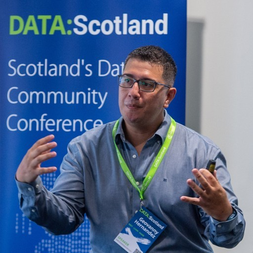
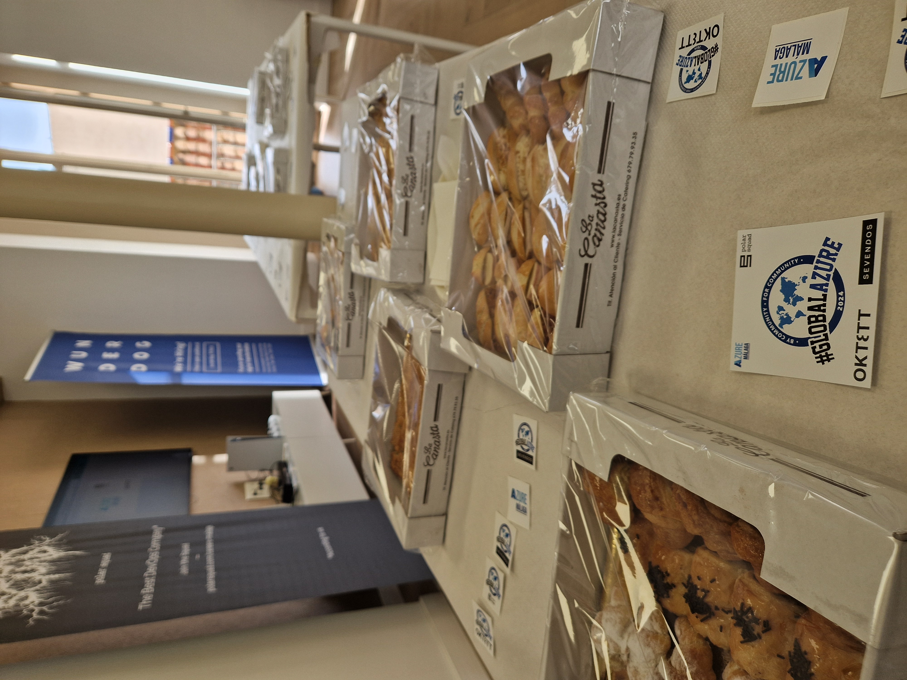
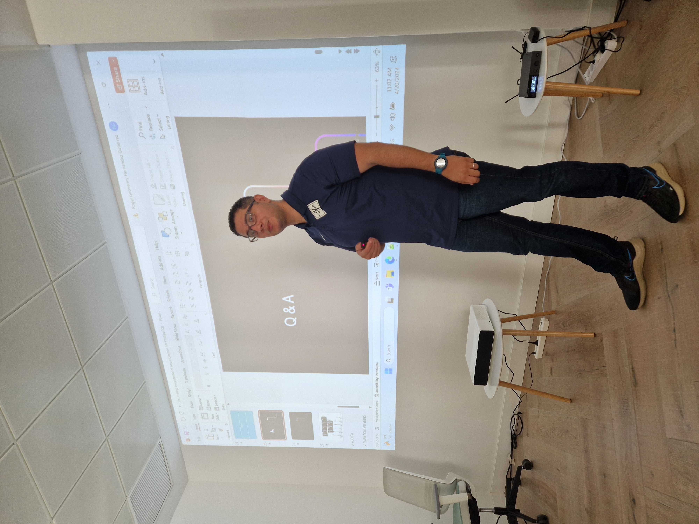
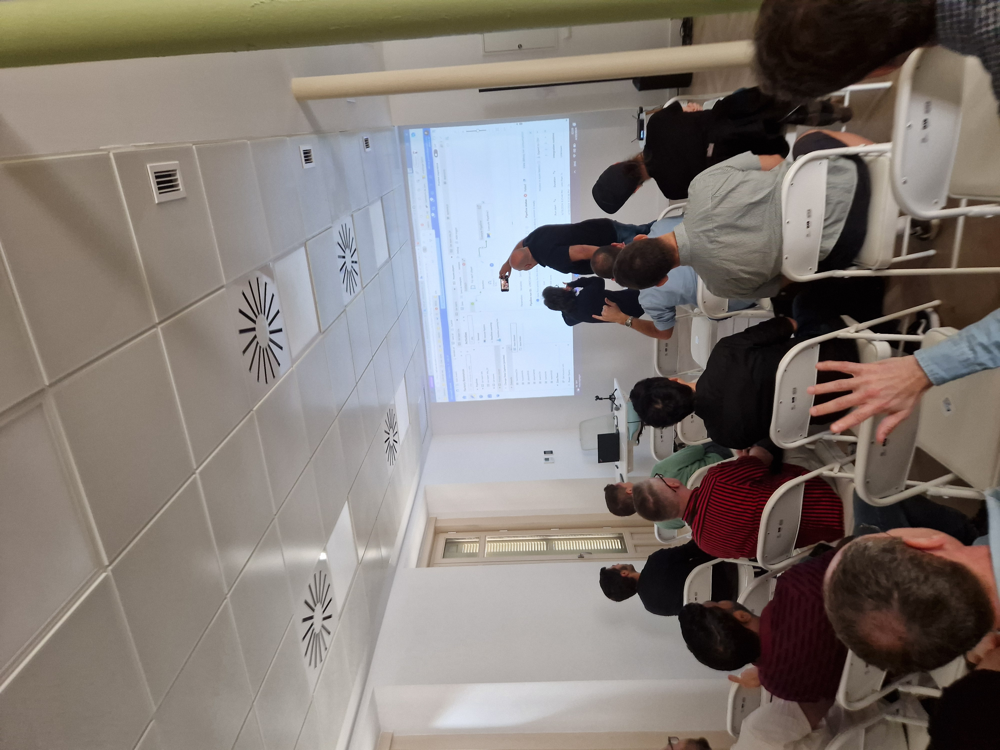
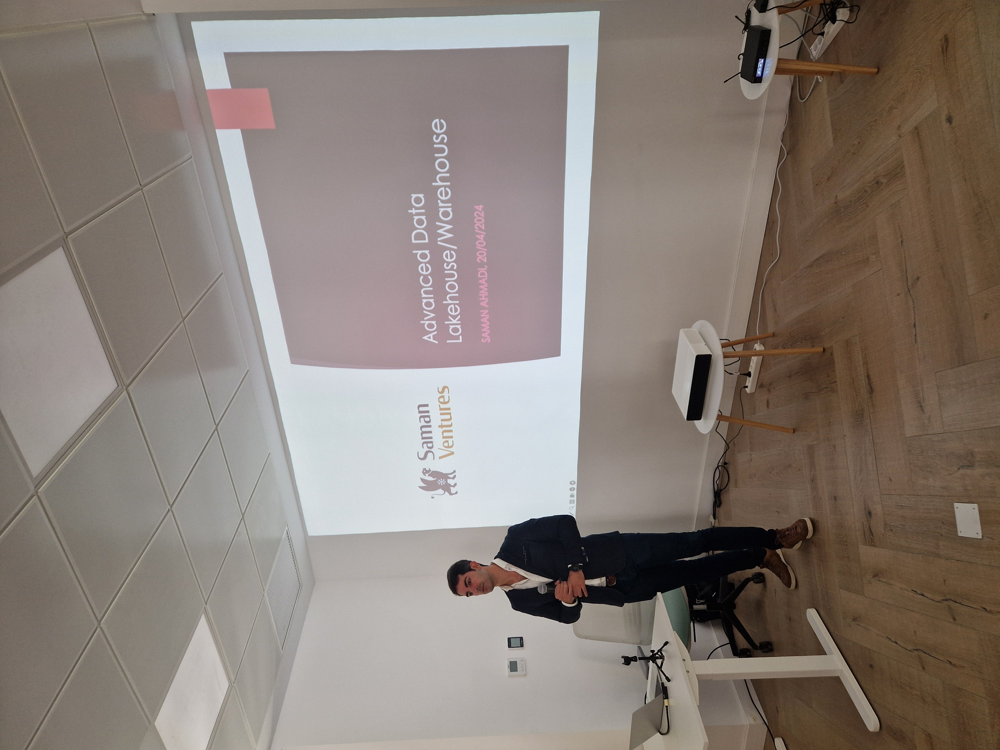
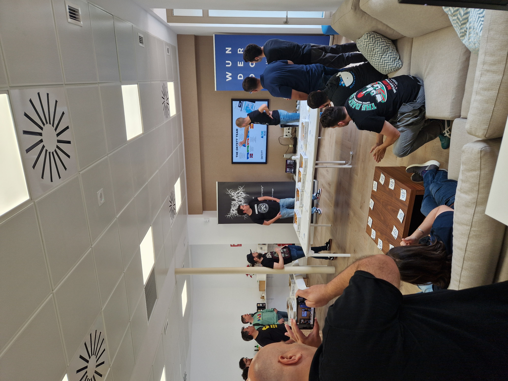
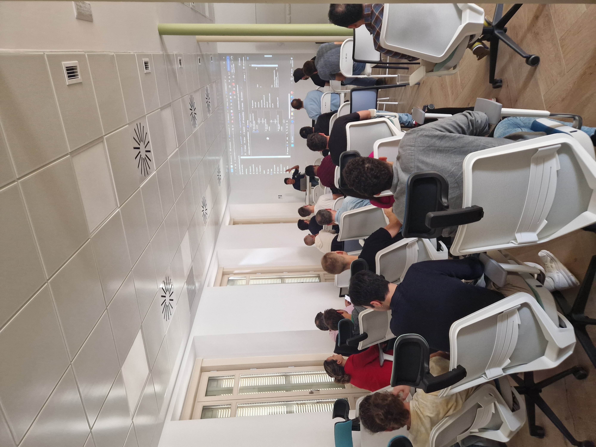
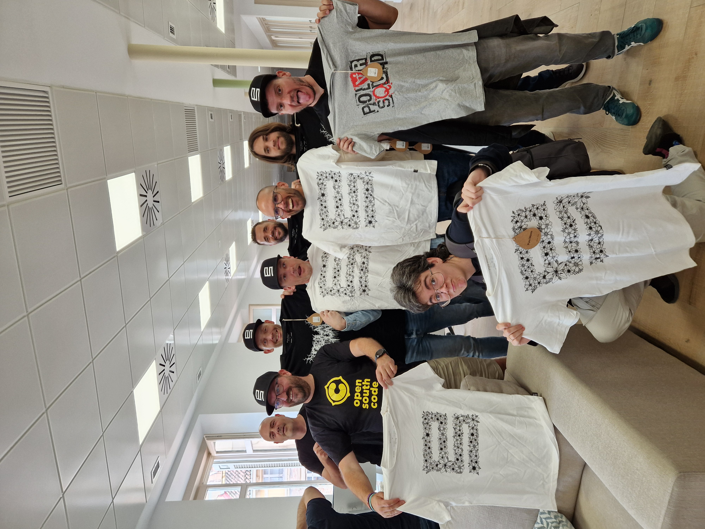

# Global Azure Malaga

On Saturday April 20th, 2024, we came together to bring the Global Azure local event in Málaga!

## Sponsors

## Links

- Follow us on LinkedIn https://www.linkedin.com/company/azurem-laga/
- Follow us at Twitter https://twitter.com/AzureMalaga
- Check our website at https://azuremalaga.com

## Sessions

### Geovanny Hernandez - Discovering the potential of Azure Cosmos for PostgreSQL

When increasing the size of your relational Database Server is not enough to face the increase in your workload, and you really need horizontal scalability, Azure Cosmos for PostgreSQL can come to the rescue.

This session focuses on giving the audience a clear picture of the scenarios where Azure Cosmos for PostgreSQL changes the game’s rules. Starting with an analysis of Distributed Systems and their application in the Database world, and how to incorporate these concepts into a relational database without losing the primary benefits associated with it.

Finally, during the session would be sharing a practical use case where Terabytes of data had been managed with exceptional performance and good modeling practices.

*Geovanny Hernandez* is a Lead Data Engineer, Microsoft Certified Trainer (MCT) and MCSE with more than fifteen years of experience in software development, passionate about Data Engineering and Data Architecture, and is involved in aspects like data modelling, performance tuning in Databases (MS SQL Server, PostgreSQL, etc), Python and Cloud technologies.

In addition, Geovanny collaborates as a speaker on different presential and virtual events around Europe and Latin America.

- [LinkedIn](https://www.linkedin.com/in/geovannyhernandez/)
- [Twitter](https://twitter.com/datawithgeo)

### Elena G Blanco & Jorge Fernández Sánchez - Dominando datos en Azure Data Factory

El futuro está en los datos, hay tantos que pueden ser abrumadores…

Para dominarlos en su plenitud y usarlos a nuestro favor, tenemos que usar las herramientas adecuadas. Y es aquí donde entra Azure Data Factory.

Esta plataforma de orquestación, ETL y ELT para el manejo de datos entre diversos orígenes y destinos pueden ser clave para que no te devoren los datos.

Veremos qué es, cómo se usa y el modo de aplicar buenas prácticas según la cultura DevOps (con Azure DevOps o GitHub).

*Elena G Blanco* code witch.
Microsoft MVP (verified) | speaker | worldbuilding, storytelling 📝🌃 | game design, futurism 💻📱🎮 | NB, she/they | opinions are my own | playing ⚾

- [LinkedIn](https://www.linkedin.com/in/elena-guzman-blanco/)
- [Twitter](https://twitter.com/Beelzenef_)

*Jorge Fernández Sánchez* Prodware, Senior Power Platform & .Net Engineer.
Tiene el placer de poder disfrutar desde hace más de 17 años del mundo de la tecnología, al igual que poder contribuir a la comunidad, he desarrollado labores de desarrollador y teamleader en diferentes compañías, siempre en entornos Microsoft. Seguimos aprendiendo… Colaboro con #TenerifeDev

- [LinkedIn](https://www.linkedin.com/in/jorgefdezsanchez/)
- [Twitter](https://twitter.com/jorgefdezsa)

### Saman Ahmadi - Advanced Data Warehouse/Lake house on Global Azure 2024

Join us for an insightful session where we delve into the cutting-edge realm of modern data warehousing leveraging the power of Lakehouse architecture on Azure. In this talk, we’ll explore how to seamlessly integrate various tools and technologies like dbt (data build tool), Terraform, and Databricks to construct a robust and scalable data infrastructure.

Throughout the session, we’ll uncover the key principles behind Lakehouse architecture, bridging the gap between traditional data warehousing and modern data lakes. You’ll gain a comprehensive understanding of how Azure services can be harnessed to create a unified platform for storage, processing, and analytics.

*Saman* has a master’s degree in IT and over 15 years of experience working in the Microsoft ecosystem and is currently based in Spain. He excels in business and technology strategic planning and implementation. He works as an independent professional helping enterprises with data, analytics and DevOps challenges.

- [LinkedIn](https://www.linkedin.com/in/samana/)
- [Twitter](https://twitter.com/samanax)

### Manuel Martin Mairal - Explotando los Aceleradores de Chat Bots de Microsoft

Explora el universo de los aceleradores y repositorios de laboratorio disponibles en Microsoft Azure de una forma clara y sencilla. Sumérgete en las posibilidades y el valor diferenciador de cada uno de estos aceleradores con los recursos de Microsoft Azure. Durante esta sesión, profundizaremos en el acelerador «Chat with your data», explorando su potencial innovador y las potenciales líneas de desarrollo con rigurosidad y perspectiva según tu caso de uso. Únete a nosotros para descubrir cómo estas herramientas pueden arrancar tu proyecto de forma equilibrada y robusta en el actual panorama tecnológico.

*Manuel* is a ML Engineer – MLOps and Data Scientist.
He has been focused working on Artificial Projects for the last seven years

- [LinkedIn](https://www.linkedin.com/in/manuel-m-43b724142/)
- [Twitter](https://twitter.com/mmartin_DS)

## Photos

